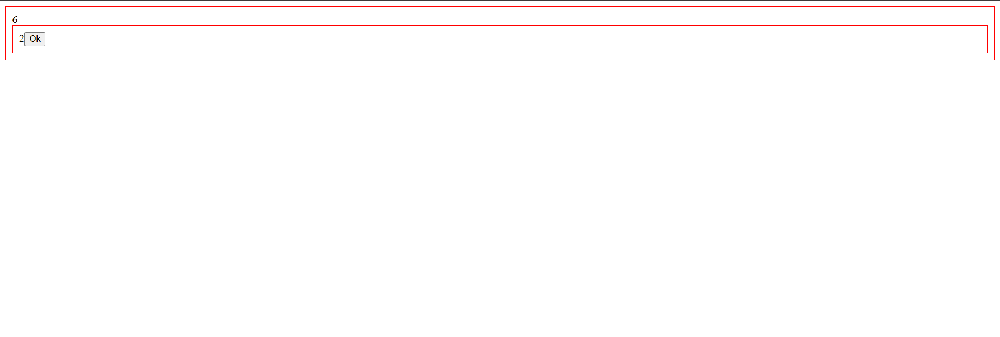

# React Eventos — Filho → Pai (Lifting State)

Projeto simples em **React + TypeScript + Vite** para praticar **eventos (onClick)** e **comunicação do componente filho para o componente pai** usando **props de callback** (padrão conhecido como *lifting state up*).

## Preview



## Link do repositório

- GitHub: [MiltonRafaeel/react-eventos](https://github.com/MiltonRafaeel/react-eventos)

## O que foi praticado

- Manipulação de eventos no React (`onClick`)
- Estado local com `useState`
- Envio de dados do **Filho → Pai** via função recebida por `props`
- Atualização de estado no componente pai baseada no valor vindo do filho

## Como funciona

- **`ChieldComponent`** mantém um contador local (`count`).
  - Ao clicar no botão **Ok**, ele incrementa o contador e chama `onNewValue(newCount)`.
- **`ParentComponent`** recebe esse valor no callback `handleNewValue(newValue)`.
  - O pai calcula o **triplo** do valor recebido e salva em `triple`:
    - `setTriple(newValue * 3)`
  - O valor `triple` é exibido na tela.

> Ou seja: o filho “avisa” o pai sobre o novo valor, e o pai decide o que fazer com ele (regra de negócio).

## Tecnologias utilizadas

- React (v19)
- TypeScript
- Vite
- Yarn
- ESLint

## Como executar (Yarn)

```bash
# 1) Clonar
git clone https://github.com/MiltonRafaeel/react-eventos.git

# 2) Entrar na pasta + instalar dependências + rodar
cd react-eventos && yarn && yarn dev
